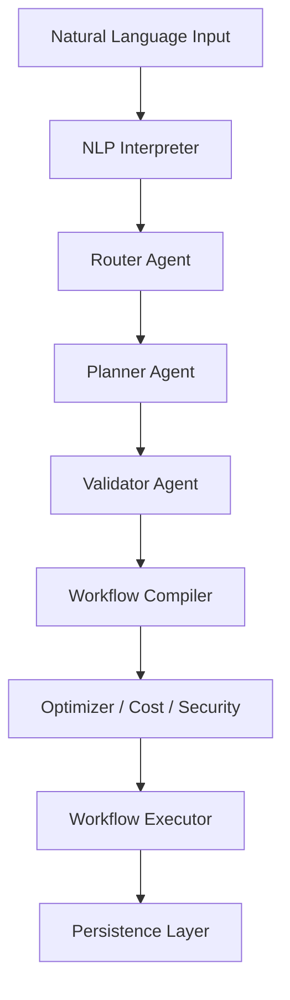

# BotSmith

**A Governed Multi-Agent System for Building Bots from Natural Language**

BotSmith is a modular, production-oriented multi-agent framework that converts natural language requests into planned, validated, governed, and executable workflows. It is designed to demonstrate how autonomous agents can be built safely, with strong separation of concerns, deterministic execution, and full observability.

> This is not a prompt toy or a chat wrapper. BotSmith focuses on control, correctness, and extensibility.

## Key Capabilities

### Natural Language Interface
Parses user intent from plain English with confidence and ambiguity handling.

### Planner–Compiler–Executor Architecture
Translates intent to plan to workflow to execution deterministically.

### Hybrid Agent System
- **Logic-first agents** for planning, validation, routing, execution
- **LLM-assisted agents** where language reasoning is useful
- **Model-agnostic design** via LLM abstraction

### Governance Built In
- Validation gates
- Cost estimation
- Security scanning
- Workflow optimization

### End-to-End Tested
Full integration tests covering the complete lifecycle.

### Persistence
Workflow runs and execution logs stored via SQLite for auditability.

## High-Level Architecture



Each stage is explicit, testable, and replaceable.

## Core Design Principles

- **SOLID and Clean Architecture**
- **Dependency Inversion** (interfaces over implementations)
- **Deterministic execution**
- **No blind trust in LLMs**
- **Governed autonomy over raw autonomy**

## Agent Types

### Core Logic Agents
- **RouterAgent**: selects the appropriate workflow
- **PlannerAgent**: generates a structured execution plan
- **ValidatorAgent**: validates plans and invariants
- **WorkflowCompilerAgent**: compiles plans into executable workflows
- **WorkflowExecutor**: executes workflows step by step
- **CostEstimatorAgent**: estimates and gates execution cost
- **SecurityAgent**: blocks unsafe operations
- **WorkflowOptimizerAgent**: reorders and deduplicates steps

### NLP Agent
- **NLPInterpreterAgent**: LLM-assisted semantic parsing, Schema validation, Confidence and ambiguity handling

### LLM Support
- **Local inference** via Ollama
- **Cloud-ready design** (Groq, Gemini, OpenAI supported via abstraction)

## Example End-to-End Flow

**User**: "Build a Python weather bot"

1.  NLP extracts intent
2.  Router selects `bot_creation_workflow`
3.  Planner generates steps
4.  Validator enforces correctness
5.  Compiler builds workflow
6.  Cost and security checks pass
7.  Executor runs steps
8.  Execution persisted to database

## Running Tests

### Create and activate a virtual environment

```bash
python -m venv .venv
source .venv/bin/activate
# Windows: .venv\Scripts\activate
```

### Install dependencies

```bash
pip install -r requirements.txt
```

### Run integration tests

```bash
pytest tests/integration
```

### Run full end-to-end test

```bash
pytest tests/integration/test_end_to_end_creation.py
```

## Current Status

- Core engine complete
- Governance pipeline implemented
- NLP to execution fully wired
- End-to-end tested
- **UI and visualization**: Initial React/Vite UI with Tailwind CSS (`botsmith-ui`)
- **API layer**: FastAPI implementation started
- **CLI interface**: Basic CLI capabilities
- Persistent agent memory
- Advanced visualizations

## Planned

- Dynamic Agent Synthesis

- Role-Based LLM Selection

- Adaptive Workflow Construction

- Human-in-the-Loop Control Gates

- Automated Validation & Debug Loops

- Defensive Security & Safety Checks

- Tool & Agent Registry System

- Execution Transparency & Observability

## Project Structure

```text
botsmith/
├── core/               # Interfaces, base classes, utilities
├── agents/             # Specialized agents
├── workflows/          # Workflow compiler and executor
├── nlp/                # NLP parsing and intent normalization
├── persistence/        # SQLite persistence layer
├── factory/            # Agent and workflow factories
├── tests/              # Unit, integration, end-to-end tests
├── botsmith-ui/        # React + Vite + Tailwind CSS Frontend
└── main.py
```

## Why This Project Exists

Most AI agent projects focus on prompting. BotSmith focuses on systems design.

The goal is to demonstrate how autonomous systems can be structured, governed, tested, and safely extended.

This repository is intended as a portfolio-grade systems project, not a product demo.

## License

MIT
